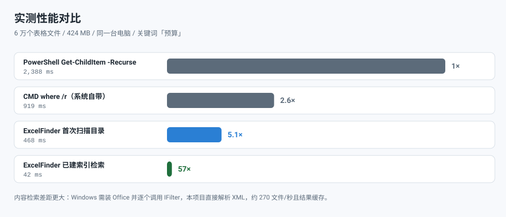

<div align="center">
  
</div>

<div align="center">

**在几万个 Excel 里，找出「哪个工作表的哪个单元格」写着你找的那个词。**

[](#运行环境)
[](#方式二从源码运行)
[](#引擎设计要点)
[](LICENSE)
[](#打包与分发)

</div>

---

## 这是什么

一个**免安装的单文件 Windows 程序**：指定一个目录，它把里面所有 Excel / CSV 文件建一次索引，
之后按关键词检索是**毫秒级**的，并且能告诉你命中的确切位置。

```
检索      : '张伟'（范围：内容）
结果      : 3,382 个命中，耗时 166.63 ms
  2021产品路线图_000055.xlsx
      → 工作表「西北汇总」D16 = 张伟
        该行: 15 | 2023-09-10 | 客服部 | 张伟 | 智能门锁 | 西北 | 162 | 21126 | 进行中
      → 工作表「西北汇总」D18 = 张伟
        该行: 17 | 2024-01-19 | 销售部 | 张伟 | 扫地机器人 | 华南 | 322 | 478577 | 已驳回
```

不是"这个文件里有张伟"，而是**哪张工作表、哪个单元格、那一行还有什么** ——
后者才能让你区分两个同名的「张伟」。

## 界面

<div align="center">
  
</div>

双击任何一行 → 用 Excel 或 WPS 打开，并**自动跳转并选中**那个单元格。

## 比 Windows 自带搜索快多少

<div align="center">
  
</div>

上表可用 `tools/compare_windows.py` 在自己机器上复现。它会把 `where.exe`、
`Get-ChildItem -Recurse`、Windows Search 索引（通过 OLE DB）和本项目放在同一语料上对比。

差距的来源是**架构不同**，不是实现更聪明：

| | Windows 资源管理器搜索 | ExcelFinder |
| --- | --- | --- |
| 每次搜索 | 重新遍历目录、逐个打开文件 | 查内存索引 |
| 内容检索 | 需装 Office，逐个调用 IFilter | 直接解 xlsx 内部 XML |
| 典型耗时 | 秒级到分钟级 | 42 ms（6 万文件） |

## 工作原理

<div align="center">
  
</div>

### 引擎设计要点

| 关注点 | 做法 | 原因 |
| --- | --- | --- |
| 目录遍历 | 顶层目录切成独立子树，多线程各走一棵 | 单线程 `os.walk` 在空等 I/O；实测 2–4 线程最优，再多反而因缓存争用变慢 |
| 增量扫描 | 缓存 `(路径, 大小, 修改时间)`，未变动的记录直接复用 | 复扫 6 万文件从 250 ms 降到 13 ms |
| 检索 | 索引常驻内存，查询不碰磁盘 | 42 ms，且与磁盘状态无关 |
| Excel 解析 | 正则直接读 `xl/sharedStrings.xml` 与 `xl/worksheets/*.xml` | 比 pandas/openpyxl 快一个量级，且**零第三方依赖**（单文件 exe 只有 12.6 MB 的原因） |
| 内容去重 | 同一个共享字符串在 1 万行里重复出现只记一次 | 真实报表重复率极高，省下大量内存 |
| 大小写 | 内容的小写形式只算一次并缓存，内容变更时失效 | 避免每次按键都对几十 MB 文本重新 `casefold()` |
| 关键词 | 空格分隔 = AND（`2023 销售部`） | 更贴近人的查找习惯 |
| **单元格定位** | 两段式：索引只回答"哪个文件命中"，选中/打开时对该文件做第二遍扫描 | 若在索引阶段预存全部坐标，内存要翻好几倍；实测第二遍仅 3.3 ms/文件 |

工作表名不是猜的：xlsx 的工作表要通过 `xl/_rels/workbook.xml.rels` 才能把
`sheet1.xml` 与真实标签名对上，这一步在 `_sheet_member_map()` 里做。

## 快速开始

### 方式一：直接用打包好的 exe（推荐）

下载 `ExcelFinder.exe` 双击即可，**不需要安装 Python、Office 或任何运行库**。

1. 点「浏览…」选目录 → 点「重建索引」
2. 关键词输入要查找的字符 → 回车
3. **要找单元格内容就取消勾「文件名需命中」，只勾「内容需命中」**

第一次做内容检索会解析所有文件（约 270 文件/秒，底部有进度条），完成后自动重新搜索；
结果会缓存，之后每次搜索都是毫秒级。

### 方式二：从源码运行

```bat
git clone https://github.com/Lidazou/ExcelFinder.git
cd ExcelFinder
python src\excelfinder_gui.py
```

只需要 **Python 3.10+ 标准库**，无需 `pip install` 任何东西。

命令行版：

```bat
python src\excelfinder_cli.py "D:\报表" --query 张伟 --content --cells 3
```

### 方式三：U盘便携版

```bat
python tools\build.py --zip
```

产出 `portable/` 与 `dist/ExcelFinder-portable.zip`。整个文件夹拷到U盘即可，
配置和索引写在程序旁边的 `data\`，**不在宿主电脑上留任何东西**，换盘符也不受影响。

## 使用要点

**「文件名需命中」和「内容需命中」是 AND 关系**，这是最容易踩的坑：

- 只勾「文件名需命中」→ 只在文件名里找（最快）
- 只勾「内容需命中」→ 只在单元格内容里找 ← **找人名、编号用这个**
- 两个都勾 → 文件名和内容都必须有该关键词（通常用不到）

| 想做的事 | 怎么输入 |
| --- | --- |
| 文件名含「预算」 | `预算` |
| 文件名同时含「2023」和「销售部」 | `2023 销售部`（空格 = AND） |
| 文件名以「2024」开头 | 匹配方式选「文件名前缀」 |
| 通配符 | 匹配方式选「通配符 `*` `?`」，如 `*预算*.xlsx` |
| 正则 | 匹配方式选「正则表达式」，如 `^2024.*_\d{3}\.xlsx$` |
| 找单元格里的「张伟」 | 取消勾「文件名需命中」，只勾「内容需命中」 |

**「刷新列表」(F5)** 在目录内容变化后使用：只比对文件大小和修改时间，
增删改同步进索引，再按当前关键词重搜一遍。比「重建索引」快得多。

**打开方式** 可在结果列表下方选择 *自动 / 只用 Office / 只用 WPS*，选择会被记住。

## 支持的格式

| 格式 | 文件名检索 | 单元格内容 | 单元格定位 |
| --- | :---: | :---: | :---: |
| `.xlsx` `.xlsm` `.xltx` `.xltm` `.xlam` | ✅ | ✅ | ✅ |
| `.csv` `.tsv` `.txt` | ✅ | ✅ | — 无 A1 坐标 |
| `.xlsb` `.xls` `.xlt` `.xla` `.ods` | ✅ | ⚠️ 尽力提取 | — |

`.xls` / `.xlsb` 是二进制格式，没有公开的纯 Python 解析器，本项目用"扫描可读字符串"
的方式提取，能覆盖绝大多数单元格文本但不保证 100%。**文件名检索不受影响。**

## 运行环境

| 项目 | 要求 |
| --- | --- |
| CPU | **必须 64 位（x64）**，32 位 Windows 用不了 |
| 操作系统 | 建议 Windows 10 / 11 64 位 |
| Python | ❌ 不需要（已打包进 exe） |
| VC++ 运行库 | ❌ 不需要（`VCRUNTIME140.dll`、`ucrtbase.dll` 已内嵌） |
| .NET / Java | ❌ 不需要 |
| Office / WPS | ⭕ 可选 —— 不装也能搜索/浏览/导出；装了才能"双击跳到单元格" |

用 `python tools\check_requirements.py` 可直接读出你手上 exe 的真实要求（读 PE 头）。

## 打包与分发

```bat
python tools\build.py            :: 打包 + 组装 + 全量验证（9 个步骤）
python tools\build.py --zip      :: 额外输出可分发的 zip
```

构建工具与验证脚本：

| 脚本 | 作用 |
| --- | --- |
| `tools/build.py` | 一键流水线：资源 → 运行时裁剪 → PyInstaller → 组装 → 验证 |
| `tools/make_usb_release.py` | 生成 `ExcelFinder-U盘版` 分发目录并端到端验证 |
| `tools/prune_embed.py` | **测试驱动**地裁剪内置 Python（每个候选都实测不会破坏 GUI 才删） |
| `tools/make_diagrams.py` | 从代码生成本 README 的 SVG 示意图 |
| `tools/fetch_buildtools.py` | 直接解 wheel 安装 PyInstaller（不经过 pip） |
| `tools/make_testdata.py` | 生成合成测试语料（含硬链接，用于压测路径枚举） |
| `tools/xlsxwriter_lite.py` | 纯标准库的 xlsx 写入器（造测试数据用） |

验证脚本（全部可独立运行）：

| 脚本 | 验证内容 |
| --- | --- |
| `tools/bench.py` | 引擎正确性 + 性能（扫描/解析/检索/持久化，7 组检查） |
| `tools/gui_integration.py` | 驱动真实 GUI 对象跑完整流程（扫描→检索→排序→内容匹配→打开方式→进度条） |
| `tools/test_refresh.py` | 刷新按钮：真实增删文件后列表是否跟随 |
| `tools/verify_gui_scan.py` | 运行**已打包的 EXE**，通过副作用确认扫描流水线走通 |
| `tools/verify_portable.py` | 便携包端到端：免安装、U盘存储、换位置、备用启动 |
| `tools/check_window.py` | 用 Win32 枚举窗口，证明 GUI 真的显示了窗口 |
| `tools/compare_windows.py` | 与 `where.exe` / PowerShell / Windows 搜索逐项对比 |
| `tools/check_usage.py` | 诊断"占用空间远大于文件大小"（U盘簇大小问题） |

## 常见问题

<details>
<summary><b>第一次搜内容很慢？</b></summary>

第一次需要解析所有文件（约 270 文件/秒），之后结果缓存，第二次起是毫秒级。
这就是为什么程序启动时不会自动做内容索引 —— 只有你勾了「内容需命中」才会触发。
</details>

<details>
<summary><b>换电脑、换盘符，配置会丢吗？</b></summary>

不会。便携模式下所有配置都在程序旁边的 `data\`，与盘符无关。
删掉 `data\` 即完全重置。
</details>

<details>
<summary><b>U盘上占用空间远大于文件大小？（例如 70 MB 文件占了 1 GB）</b></summary>

这是 U 盘的**簇大小**造成的，不是程序的问题。磁盘按簇分配空间，一个文件至少占 1 个簇。
同样的文件在不同簇大小下：

| 簇大小 | 占用 |
| ---: | ---: |
| 4 KB | 49.8 MB |
| **32 KB（推荐）** | **52.8 MB** |
| 512 KB | 121.5 MB |
| 8 MB | 1296 MB |

Windows 格式化大容量 U 盘为 exFAT 时，如果"分配单元大小"选了默认或很大的值，
簇可能达到几 MB。用 `python tools\check_usage.py E:\` 可以直接查出来。
修法是备份后重新格式化为 exFAT + 分配单元大小 32 KB。
</details>

<details>
<summary><b>被杀毒软件拦截？</b></summary>

本程序没有数字签名，PyInstaller 打包的 exe 容易被误报。可以：

1. 右键 exe → 属性 → 勾选「解除锁定」
2. 或用内置 Python 直接跑源码：`python\pythonw.exe run_gui.py`
3. 或只用命令行版 `ExcelFinder-cli.exe`
</details>

<details>
<summary><b>为什么不用 Everything / Windows 搜索索引？</b></summary>

它们索引的是**文件名**，对 Excel 单元格里的内容无能为力。
Windows Search 能搜内容，但要求目标机器装了 Office（靠 IFilter），
而且每次搜索都要重新打开文件。本项目自己解析 OOXML，无需 Office，且结果可缓存。
</details>

## 已知限制

- **未做数字签名**，可能触发 SmartScreen / 企业策略拦截（见上方 FAQ）
- **`.xls` / `.xlsb` 内容解析是尽力而为**，二进制格式无公开解析器
- **内容索引常驻内存**，约每文件 1–5 KB（取决于文字量）；超过 256 MB 不再写磁盘缓存
- **单元格定位只对前 500 行做预解析**，其余行在点选时按需定位，避免打开上万个文件拖慢列表
- **只支持 Windows**，代码里用了 `winreg`、`powershell` COM 等 Windows 专有接口

## 项目结构

```
ExcelFinder/
├─ src/
│  ├─ excelfinder_core.py     引擎：扫描 / 索引 / 匹配 / OOXML 解析 / 便携模式（纯标准库）
│  ├─ excelfinder_gui.py      tkinter 图形界面
│  └─ excelfinder_cli.py      命令行入口
├─ tools/                     构建与验证脚本
├─ docs/images/               README 示意图（由 tools/make_diagrams.py 生成）
├─ assets/                    图标与版本资源
└─ *.spec                     PyInstaller 打包配置
```

## License

[MIT](LICENSE)

---

<details>
<summary><b>English summary</b></summary>

**ExcelFinder** is a portable, dependency-free Windows tool that indexes Excel/CSV files
and searches inside their cells. It answers *"which sheet and which cell contains this
value"*, not just *"which file matches"* — so you can tell two same-named records apart.

- **Single 12.6 MB exe**, no Python / Office / runtime needed on the target machine
- **Two-phase design**: the index only records *which file* matches; cell coordinates are
  resolved on demand (3.3 ms per file) — pre-storing every coordinate would multiply memory
- **Zero third-party dependencies**: xlsx is parsed from its internal XML directly,
  which is ~10× faster than pandas/openpyxl and keeps the binary small
- **42 ms query** over 60,000 files (indexed), vs 2,388 ms for PowerShell and 919 ms for `where /r`
- Supports Excel, WPS, and a USB-portable mode that leaves nothing on the host PC

Run `python tools\compare_windows.py` to reproduce the benchmark on your own machine.

</details>
